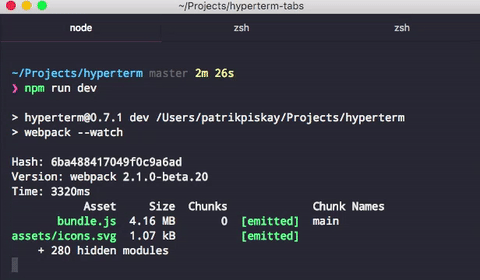

# hyperterm-tabs

> [HyperTerm](https://hyperterm.org) drag&drop tabs support

    

## Install

Add `hyperterm-tabs` to the `plugins` list in your `~/.hyperterm.js` config file.

***NOTE:*** *This plugin sets the title bar to be visible so it is still possible to move the terminal window around.*
